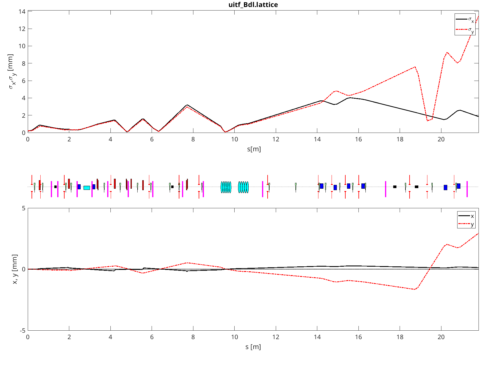

# UITFTwin
An epics-controlled digital twin of UITF

Most of the file

* Subdirectories
  * matlab/:
    * digital_twin.m: main program
    * read_lattice_file: does what the name says
    * do_all_plots.m: makes the figures
    * make_viewer_image.m: creates the figures with viewer images
    * misalign_magnets.m: shuffles the transverse magnet positions
    * debug_interface.m: add interface to vary individual entries in lattice file
    * ifind.m and find_bpm.m: low-level functions to find elements
    * write_epics_files.m: writes the epics database files and protocol files for magnets and BPM
    * add_bpm_to_epics.m: this handles the BPM details
    * add_magnets_to_protocol_file.m: handles the magnet details
    * write_all_corrector_file.m: writes the python corrector file for all correctors
    * write_python_corrector_file.m: writes the stanza for one corrector
    * write_all_quad_file.m: writes python interface to control quads and solenoids
    * write_python_magnet_file.m: writes it for one magnet
    * uitf.lattice: beamline description file using k-values
    * uitf_Bdl.lattice: beamline description file using integrated field strengths from the control system
    * kvalues2Bdl.m: converts the the k-values to Bdl by using the energy profile dynamically calculated from the current values of gun high-voltage and cavity settings 
    * 4D/: contains the beam optics calculations. They are described in https://library.oapen.org/handle/20.500.12657/98031
  * python/: contains the interface scripts in python
  * epics/: contains protocol and database files, as well as executable st.cmd

Much of the Matlab code for beam optics calculations is described in *V. Ziemann, Hands-On Accelerator Physics Using MATLAB, 2nd edition, CRC Press, Boca Raton, 2025*. The book is available Open Access from https://library.oapen.org/handle/20.500.12657/98031 or free from Amazon.
